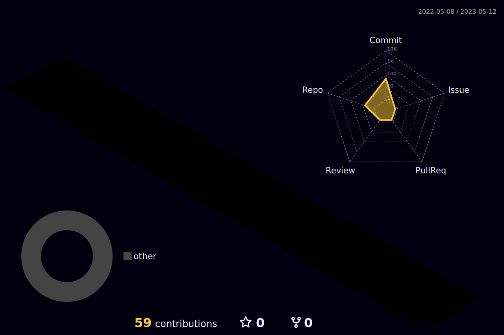

<body>
  

    <h1 style="color: #F7CC18FF;">Hi there, I'm Syed Ghani👋</h1>
  

  

    
  

  <h3>I'm a Python Developer and Data Science Enthusiast</h3>
  <ul>
    <li>🔭 I’m a Graduate of Computer Science</li>
    <li>🌱 I’m currently expanding my knowledge in Data Science.</li>
    <li>👯 I’m looking to collaborate with other content creators and developers.</li>
    <li>📢 Love to teach and inspire students.</li>
    <li>🥅 2023-24 Goals: Contribute more to Open Source projects and Execute my Innovative ideas.</li>
    <li>💎 If you are a Tech boy/girl let's get connected</li>
  </ul>	
<h2>Tech Stack</h2>

<table>
<tr>
<td align='center'>

</td>
<td align='center'>

</td>
<td align='center' width="200">

</td>
<td align='center' width="200">

</td>
<td align='center' width="200">

</td>
</tr>
<tr>	
<td align='center' width="200">

</td>
<td align='center' width="200">

</td>
<td align='center' width="200">

</td>
<td align='center' width="200">

</td>
<td align='center' width="200">
  
</td>
</tr>
</table>

  
  
  
  

<table>
  <tr>
    <th>Stats</th>
    <th>Streak</th>
    <th>Languages</th>
  </tr>
  <tr>
    <td></td>
    <td></td>
    <td></td>
  </tr>
</table>
	

	
## Personal Projects

| Project :octocat: | Issues :bug: | Open PRs :bell: | Closed PRs :fire: | Last Commit 🚩 |
| ----------------- | ------------- | ---------------- | ------------------ | -------------- |
| [**Leetcode Practice**](https://github.com/sghani001/Leetcode) |  |  |  |  |
| [**Github Profile**](https://github.com/sghani001/sghani001) |  |  |  |  |

## ⚡️Github Contributions

<h4 align="center">Isometric view of contributions in the last year</h4>

  

## 🚀Github Metrics

    

    
## 🐛Github Magic Game

  

 

 
  Views 
  

		

<h2 >🏆 GitHub Profile Trophy</h2>

 
  Views 
  

