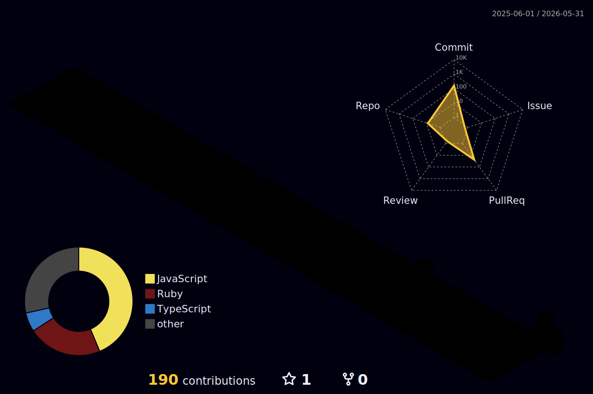

  <h1 style="color: #F7CC18FF;">Hi there, I'm Syed Ghani👋</h1>

  

---

## 🌐 Socials:
   

---

## 👨‍💻 About Me

I'm a Software Engineer specializing in Ruby on Rails and React.js

- 🔭 I'm a Graduate of Computer Science
- 🌱 I'm currently expanding my knowledge in **Ruby On Rails** and **React.js**
- 👯 I'm looking to collaborate with other content creators and developers
- 📢 Love to teach and inspire students
- 🥅 2024-25 Goals: Contribute more to Open Source projects and Execute my Innovative ideas
- 💎 If you are a Tech boy/girl let's get connected

---

## 💻 Tech Stack:

                     

---

## 📊 GitHub Stats:

<table>
  <tr>
    <th>Stats</th>
    <th>Streak</th>
    <th>Languages</th>
  </tr>
  <tr>
    <td></td>
    <td></td>
    <td></td>
  </tr>
</table>

---

## 🏆 GitHub Trophies

  

---

## 📁 Personal Projects

| Project :octocat: | Issues :bug: | Open PRs :bell: | Closed PRs :fire: | Last Commit 🚩 |
| ----------------- | ------------- | ---------------- | ------------------ | -------------- |
| [**Leetcode Practice**](https://github.com/sghani001/Leetcode) |  |  |  |  |
| [**Github Profile**](https://github.com/sghani001/sghani001) |  |  |  |  |

---

## 🔝 Recent repositories

Public work under [@sghani001](https://github.com/sghani001): every repo **sorted by last push** (newest first). Stars, primary language, and dates refresh from the GitHub API on a schedule—no manual edits.

<!-- RECENT_REPOS_TABLE_START -->

_**20** public repositories · sorted by **last push** (newest first) · auto-updated by GitHub Actions_

| # | Repository | Language | Stars | Last push | Description |
|--:|:-----------|:---------|------:|:----------|:------------|
| 1 | [**human_capital_managment**](https://github.com/sghani001/human_capital_managment) | TypeScript | 0 | 2026-04-24 | — |
| 2 | [**sghani001**](https://github.com/sghani001/sghani001) | — | 1 | 2026-04-24 | — |
| 3 | [**hos-trip-planner**](https://github.com/sghani001/hos-trip-planner) | Python | 0 | 2026-04-15 | Django Test Project |
| 4 | [**personal_portfolio**](https://github.com/sghani001/personal_portfolio) | JavaScript | 0 | 2026-02-22 | — |
| 5 | [**Leetcode**](https://github.com/sghani001/Leetcode) | Ruby | 0 | 2026-02-22 | — |
| 6 | [**Online_Exam_System**](https://github.com/sghani001/Online_Exam_System) | Ruby | 0 | 2024-08-27 | — |
| 7 | [**Portfolio_new**](https://github.com/sghani001/Portfolio_new) | HTML | 0 | 2024-08-07 | — |
| 8 | [**Rails_Meal_tracker**](https://github.com/sghani001/Rails_Meal_tracker) | Ruby | 0 | 2024-08-07 | — |
| 9 | [**portfolio**](https://github.com/sghani001/portfolio) | HTML | 0 | 2024-02-18 | — |
| 10 | [**SignUP_Form**](https://github.com/sghani001/SignUP_Form) | JavaScript | 0 | 2023-08-06 | — |
| 11 | [**Javascript-practice**](https://github.com/sghani001/Javascript-practice) | JavaScript | 0 | 2023-07-26 | — |
| 12 | [**javascripts-practice**](https://github.com/sghani001/javascripts-practice) | — | 0 | 2023-07-25 | — |
| 13 | [**Whatsapp_Analyzer**](https://github.com/sghani001/Whatsapp_Analyzer) | Python | 0 | 2023-07-23 | Whatsapp Analyzer is made using python. Whatsapp Analyzer analyzes messages from a group chat as well as fr… |
| 14 | [**css-practice**](https://github.com/sghani001/css-practice) | HTML | 0 | 2023-07-20 | — |
| 15 | [**HTML-practice**](https://github.com/sghani001/HTML-practice) | HTML | 0 | 2023-07-19 | — |
| 16 | [**Olympics**](https://github.com/sghani001/Olympics) | Python | 0 | 2023-05-25 | Olympics Analysis |
| 17 | [**saadfareed**](https://github.com/sghani001/saadfareed) `fork` | — | 0 | 2023-05-12 | Saad Fareed Portfolio |
| 18 | [**python-practice**](https://github.com/sghani001/python-practice) | — | 0 | 2023-04-13 | — |
| 19 | [**Hello-world-Python**](https://github.com/sghani001/Hello-world-Python) | — | 0 | 2022-08-26 | — |
| 20 | [**data-wrangling**](https://github.com/sghani001/data-wrangling) `fork` | — | 0 | 2020-04-12 | Codes related to data wrangling |

<!-- RECENT_REPOS_TABLE_END -->

_To include **private** repositories in this list, add a repository secret `PROFILE_README_TOKEN` (fine-scoped or classic PAT with **Contents** read on your repos) on [sghani001/sghani001](https://github.com/sghani001/sghani001)._

---

## ⚡️ Github Contributions

<h4 align="center">Isometric view of contributions in the last year</h4>

  

---

## 🚀 Github Metrics

  

---

## 🐛 Github Magic Game

  

---

## ✍️ Random Dev Quote

  

---

  

---

<!-- Proudly created with GPRM ( https://gprm.itsvg.in ) -->
