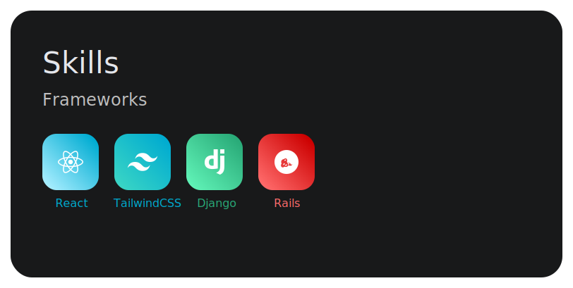

<!-- HEADER WAVE -->


<!-- FLOATING STICKER (DIMFLIX style) + INTRO -->
<div align="center">


<h3>
  <samp>
    &gt; Hey There! I am &nbsp;
    <b><a href="https://syedghani.is-a.dev/" target="_blank">Syed M. Ghani</a></b>
  </samp>
</h3>

<p><samp>「 Full-Stack Engineer · Building Production SaaS with Rails & React · Lahore 🇵🇰 」</samp></p>


<br/><br/>

[](https://pk.linkedin.com/in/syed-m-ghani-357ba4234)
[](https://github.com/sghani001)
[](https://leetcode.com/syedghani/)
[](https://syedghani.is-a.dev/)
[](mailto:syedghani001@gmail.com)

<br/>


[](https://github.com/sghani001)

</div>

<!-- ANIMATED DIVIDER -->
[](#)

## ⚡ About Me

```ruby
class SyedGhani
  ROLE       = "Full-Stack Software Engineer"
  LOCATION   = "Lahore 🇵🇰  · Remote / On-site / Hybrid"
  EXPERIENCE = "2+ years · Production SaaS · 6 shipped products"
  COMPANY    = "Ex: Blackstack Software Solutions"
  EDUCATION  = "B.Sc. CS — UET Lahore · GPA 3.1/4.0"

  STACK = {
    backend:      ["Ruby on Rails 5/6/7", "REST API", "PostgreSQL", "MySQL", "Redis", "Sidekiq"],
    frontend:     ["React.js", "Redux Toolkit", "TailwindCSS", "React Query", "Vite", "JavaScript ES6+"],
    payments:     ["Stripe", "Paddle", "Chargebee"],
    integrations: ["HubSpot CRM", "Moodle LMS (SSO/LTI)", "Documenso (e-signatures)"],
    rails_gems:   ["Devise", "Pundit", "Kaminari", "ActiveAdmin", "ActiveStorage", "Sidekiq"],
    learning:     ["Python 🐍", "Django", "AI Automation ✦ Backend Tools"]
  }

  def superpower
    "Sole engineer on CinnaLab PRM — designed, built & shipped end-to-end 🚀"
  end
end
```

<!-- ANIMATED DIVIDER -->
[](#)

## 🛠 Tech Stack

<!-- SECTION 1: Languages via WidgetBox (verified supported list only) -->
<div align="center">

**Languages**

[](https://github.com/sghani001)

</div>

<!-- SECTION 2: Frameworks via WidgetBox (only confirmed supported: react, tailwind, django — NOT rails, NOT redux) -->
<div align="center">

**Frameworks**

[](https://github.com/sghani001)

</div>

<!-- SECTION 3: Tools via WidgetBox (confirmed supported list) -->
<div align="center">

**Tools**

[](https://github.com/sghani001)

</div>

<!-- SECTION 4: Software via WidgetBox -->
<div align="center">

**Software & IDE**

[](https://github.com/sghani001)

</div>

<!-- SECTION 5: Full icon grid — devicons only, raw.githubusercontent for reliability -->
<!-- Rails & Redux shown here since WidgetBox doesn't support them -->
<div align="center">

**Full Stack at a Glance**

<br/>

&nbsp;&nbsp;
&nbsp;&nbsp;
&nbsp;&nbsp;
&nbsp;&nbsp;
&nbsp;&nbsp;
&nbsp;&nbsp;
&nbsp;&nbsp;
&nbsp;&nbsp;
&nbsp;&nbsp;
&nbsp;&nbsp;
&nbsp;&nbsp;
&nbsp;&nbsp;
&nbsp;&nbsp;


<br/><br/>

<!-- Integrations & payment tools that have no devicon — use shields badges -->


</div>

<!-- ANIMATED DIVIDER -->
[](#)

## 📊 GitHub Stats

<div align="center">

[](https://github.com/sghani001)

</div>

<br/>

<div align="center">


&nbsp;


</div>

<br/>

<div align="center">


</div>

[](#)

## ⚡ Contribution Activity

<div align="center">


<br/><br/>

[](https://github.com/sghani001)

</div>

<!-- ANIMATED DIVIDER -->
[](#)

## 🧠 LeetCode Journey

<!-- Live LeetCode card with heatmap — pulls from LeetCode API -->
<div align="center">

[](https://leetcode.com/syedghani/)

</div>

<br/>

**Topic Coverage**

<div align="center">


</div>

<details>
<summary><b>📋 Solutions List</b></summary>
<br/>

| # | Problem | Lang | Difficulty |
|--:|---------|:----:|:---:|
| 1 | [Two Sum](https://github.com/sghani001/Leetcode/blob/main/2._Two_sum.py) | 🐍 | 🟢 |
| 2 | [Add Two Numbers](https://github.com/sghani001/Leetcode/blob/main/2._Add_Two%20_Num.py) | 🐍 | 🟡 |
| 3 | [Longest Substring Without Repeating Chars](https://github.com/sghani001/Leetcode/blob/main/003_longest_substring_without_repeating_characters.rb) | 💎 | 🟡 |
| 4 | [Median of Two Sorted Arrays](https://github.com/sghani001/Leetcode/blob/main/004_median_of_two_sorted_arrays.rb) | 💎 | 🔴 |
| 4 | [Median of Two Sorted Arrays](https://github.com/sghani001/Leetcode/blob/main/4._Median_of_Two_Sorted_Arrays.py) | 🐍 | 🔴 |
| 5 | [Longest Palindromic Substring](https://github.com/sghani001/Leetcode/blob/main/005_longest_palindromic_substring.rb) | 💎 | 🟡 |
| 6 | [Zigzag Conversion](https://github.com/sghani001/Leetcode/blob/main/006_zigzag_conversion.rb) | 💎 | 🟡 |
| 7 | [Reverse Integer](https://github.com/sghani001/Leetcode/blob/main/007_reverse_integer.rb) | 💎 | 🟡 |
| 8 | [String to Integer (atoi)](https://github.com/sghani001/Leetcode/blob/main/008_string_to_integer_atoi.rb) | 💎 | 🟡 |
| 9 | [Palindrome Number](https://github.com/sghani001/Leetcode/blob/main/9._Palindrome_Number.py) | 🐍 | 🟢 |
| 10 | [Regular Expression Matching](https://github.com/sghani001/Leetcode/blob/main/010_regular_expression_matching.rb) | 💎 | 🔴 |
| 11 | [Container With Most Water](https://github.com/sghani001/Leetcode/blob/main/11.%20Container%20With%20Most%20Water.py) | 🐍 | 🟡 |
| 12 | [Integer to Roman](https://github.com/sghani001/Leetcode/blob/main/012_integer_to_roman.rb) | 💎 | 🟡 |
| 13 | [Roman to Integer](https://github.com/sghani001/Leetcode/blob/main/13.%20Roman%20to%20Integer.py) | 🐍 | 🟢 |
| 14 | [Longest Common Prefix](https://github.com/sghani001/Leetcode/blob/main/14.%20Longest%20Common%20Prefix.py) | 🐍 | 🟢 |
| 15 | [3Sum](https://github.com/sghani001/Leetcode/blob/main/15.%203Sum.py) | 🐍 | 🟡 |
| 16 | [3Sum Closest](https://github.com/sghani001/Leetcode/blob/main/016_3sum_closest.rb) | 💎 | 🟡 |
| 17 | [Letter Combinations](https://github.com/sghani001/Leetcode/blob/main/017_letter_combinations.rb) | 💎 | 🟡 |
| 20 | [Valid Parentheses](https://github.com/sghani001/Leetcode/blob/main/20.%20Valid%20Parentheses.py) | 🐍 | 🟢 |
| 21 | [Merge Two Sorted Lists](https://github.com/sghani001/Leetcode/blob/main/21.%20Merge%20Two%20Sorted%20Lists.py) | 🐍 | 🟢 |
| 23 | [Merge K Sorted Lists](https://github.com/sghani001/Leetcode/blob/main/023_merge_k_sorted_lists.rb) | 💎 | 🔴 |
| 25 | [Reverse Nodes in K-Group](https://github.com/sghani001/Leetcode/blob/main/025_reverse_nodes_in_k_group.rb) | 💎 | 🔴 |
| 26 | [Remove Duplicates from Sorted Array](https://github.com/sghani001/Leetcode/blob/main/26.%20Remove%20Duplicates%20from%20Sorted%20Array.py) | 🐍 | 🟢 |
| 27 | [Remove Element](https://github.com/sghani001/Leetcode/blob/main/27.%20Remove%20Element.py) | 🐍 | 🟢 |
| 28 | [Find Index of First Occurrence](https://github.com/sghani001/Leetcode/blob/main/28.%20Find%20the%20Index%20of%20the%20First%20Occurrence%20in%20a%20String.py) | 🐍 | 🟢 |
| 30 | [Substring with Concatenation of All Words](https://github.com/sghani001/Leetcode/blob/main/030_substring_with_concatenation_of_all_words.rb) | 💎 | 🔴 |
| 66 | [Plus One](https://github.com/sghani001/Leetcode/blob/main/066_plus_one.rb) | 💎 | 🟢 |
| 88 | [Merge Sorted Array](https://github.com/sghani001/Leetcode/blob/main/088_merge_sorted_array.rb) | 💎 | 🟢 |
| 136 | [Single Number](https://github.com/sghani001/Leetcode/blob/main/136_single_number.rb) | 💎 | 🟢 |

> 💎 Ruby · 🐍 Python · [→ Full Repo](https://github.com/sghani001/Leetcode)

</details>

<!-- ANIMATED DIVIDER -->
[](#)

## 🚀 Experience

<div align="center">


</div>

<br/>

**🤖 CinnaLab PRM** &nbsp;·&nbsp; *Sole Engineer*

> AI-powered Partner Relationship Management · Full product ownership from design to production · HubSpot CRM (bi-directional sync) · Moodle LMS (SSO/LTI) · Documenso (e-signatures) · Stripe + Paddle + Chargebee billing · Multi-role RBAC with Devise + Pundit · Sidekiq background jobs with retry logic · ActiveAdmin dashboards · RSpec + FactoryBot test coverage

<br/>

**🏈 Intercollegiate** &nbsp;·&nbsp; *Full-Stack*

> 2,500+ college athletics job listings · Multi-dimensional search (sport, division, conference, school, salary) · PostgreSQL query optimisation · Sidekiq email alerting · Kaminari pagination · ActiveAdmin recruiter tooling

<br/>

**📚 Bullseye Education** &nbsp;·&nbsp; *Full-Stack*

> K-12 instructional coaching platform · Teacher walkthrough & feedback capture (web + mobile-responsive) · Real-time principal/district dashboards · Deployed across multiple school districts

<br/>

**💰 Docyt** &nbsp;·&nbsp; *Backend*

> Stripe payment microservice built from scratch · Subscriptions, billing cycles, idempotent webhook handling, failure recovery · PCI-aligned data-handling patterns · Microservices architecture

<br/>

**📊 Controllr / Monthend** &nbsp;·&nbsp; *Full-Stack*

> Month-end finance SaaS · Devise auth + Google OAuth · Multi-step onboarding · API design & core product features

<br/>

**🔬 R&D Intern · KICS, UET Lahore** &nbsp;·&nbsp; *Jul – Oct 2023*

> Proof-of-concept tools · Technical documentation · Collaboration with faculty & graduate researchers

<br/>

**💻 Web Dev Intern · Apex Space** &nbsp;·&nbsp; *Jun – Aug 2023*

> Full-stack client features · Code reviews · Daily standups · Live deployment support

<!-- ANIMATED DIVIDER -->
[](#)

## 🎯 Projects

**🌐 [Personal Portfolio](https://syedghani.is-a.dev/)** &nbsp;·&nbsp; `React.js · TailwindCSS · Framer Motion` &nbsp;·&nbsp; *[Live Site](https://syedghani.is-a.dev/)*

> My premier frontend deployment featuring an interactive, fully responsive modern portfolio. Built with slick user experiences, modular React components, and optimized performance to showcase my engineering journey.

<br/>

**🧠 Urdu Signify** &nbsp;·&nbsp; `Python · GANs · NLP` &nbsp;·&nbsp; *Final Year Project — UET Lahore*

> Converts Urdu text to Pakistan Sign Language video animations using GANs + NLP. Real social impact for Pakistan's deaf community. Presented to UET faculty panel.

<br/>

**📝 [Online Exam System](https://github.com/sghani001/Online_Exam_System)** &nbsp;·&nbsp; `Rails · Devise · Pundit · RSpec`

> Multi-role RBAC exam platform (admin / teacher / student) · Full exam lifecycle state machine · Clean Rails architecture with real-world gem usage

<br/>

**✈️ [HOS Trip Planner](https://github.com/sghani001/hos-trip-planner)** &nbsp;·&nbsp; `Python · Django`

> Hours-of-service compliant trip planner built with Django

<br/>

**💬 [WhatsApp Chat Analyzer](https://github.com/sghani001/Whatsapp_Analyzer)** &nbsp;·&nbsp; `Python · pandas · Matplotlib`

> Parses raw WhatsApp exports → analytics suite: message frequency, word clouds, participant rankings, time-trend charts

<br/>

**💡 [LeetCode Solutions](https://github.com/sghani001/Leetcode)** &nbsp;·&nbsp; `Ruby · Python`

> 47 problems solved · 74.6% acceptance rate · Ruby + Python implementations

<br/>

<table width="100%">
  <tr>
    <td width="50%" valign="top">
      <h3>🌐 Featured Frontend</h3>
      <a href="https://syedghani.is-a.dev/"><b>personal_portfolio</b></a>
      <p>My flagship frontend web development showcase. Highly polished, fully responsive, and animated UI displaying full-stack software engineering milestones.</p>
      <code>React.js</code> &nbsp; <code>TailwindCSS</code> &nbsp; <code>Framer Motion</code>
    </td>
    <td width="50%" valign="top">
      <h3>🚀 Backend Architecture</h3>
      <a href="https://github.com/sghani001/Online_Exam_System"><b>Online_Exam_System</b></a>
      <p>Multi-role RBAC examinations suite built entirely using Ruby on Rails, Devise, Pundit, and RSpec testing suites.</p>
      <code>Ruby</code> &nbsp; <code>Rails</code> &nbsp; <code>RSpec</code>
    </td>
  </tr>
</table>

[](#)
## 🏆 Achievements

<div align="center">

[](https://github.com/sghani001)

</div>

<!-- ANIMATED DIVIDER -->
[](#)

## 🤝 Open to &nbsp;·&nbsp; 💬 Quote &nbsp;·&nbsp; 📫 Contact

<table width="100%" style="width: 100%; table-layout: fixed;">
<tr>

<td width="35%" valign="top" align="left">
<br/>

### 🤝 Open to

- **Remote roles** worldwide
- **Lahore** on-site / hybrid
- **Freelance** SaaS projects
- **Open-source** collaboration
</td>

<td width="35%" align="center" valign="middle">


</td>

<td width="30%" valign="top" align="center">
<br/>

### 📫 Contact

[](https://pk.linkedin.com/in/syed-m-ghani-357ba4234)

<br/>

[](https://syedghani.is-a.dev/)

<br/>

[](mailto:syedghani001@gmail.com)

</td>

</tr>
</table>
<!-- FOOTER WAVE -->


<div align="center">
<samp>⚡ Building production SaaS · Open to work · Lahore on-site · Remote worldwide</samp>
<br/>
<i>Star ⭐ the repos if they helped you!</i>
</div>
